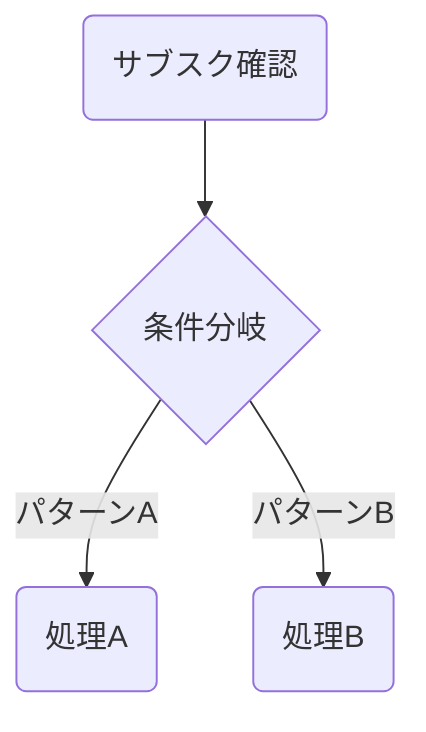

# DocBase Mermaid 記法ガイド

DocBase は Mermaid **v11.6.0** を使用(CDN: `cdn.docbase.io/mermaid@11.6.0`)。v11 固有の制約あり。

## 必須: リスト構文の回避

v11 ではノードラベルがデフォルトで Markdown パースされる。`数字. ` `- ` `* ` はリスト扱いで **Unsupported markdown: list** エラーになる。

```
NG: [1. テキスト]       ← 順序付きリスト扱い
NG: [- テキスト]        ← 箇条書きリスト扱い
OK: [Step1 テキスト]    ← ピリオド除去
OK: [テキスト]          ← 番号なし
```

## 推奨構文

- `graph TD` を使う(`flowchart TD` より安定)
- ノード内改行は `<br>` を使用
- 情報量が多い場合、図はシンプルに保ち詳細は Markdown テーブルで補足



## ER図の注意

リレーションラベルに日本語を使うとレンダリングが崩れる場合がある。英語を使用。

```
NG: SPACE ||--o{ SUBSCRIPTION : "持つ"
OK: SPACE ||--o{ SUBSCRIPTION : has
```

## 対応チャート種別

graph / flowchart, sequenceDiagram, erDiagram, gantt, classDiagram, stateDiagram-v2, pie
